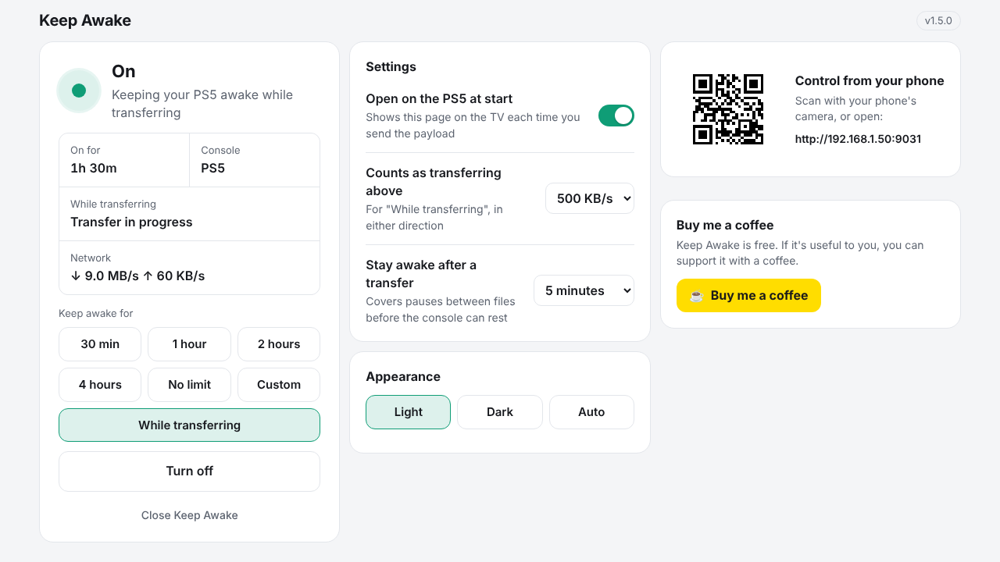
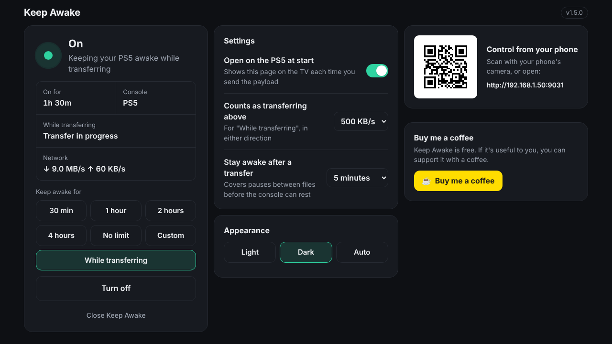
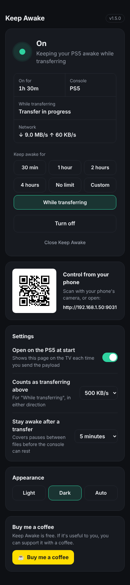

# KeepAwake

A PS5 and PS4 payload that stops the console from going into rest mode while it runs.

<p>
  
  
</p>
<p align="center">
  
</p>

## Usage

Download the payloads from the [Releases](https://github.com/mortyzip/KeepAwake/releases) page.

| Console | File | Send to |
|---|---|---|
| PS5 | `keepawake_ps5_v<version>.elf` | ELF loader, port 9021 |
| PS4 | `keepawake_ps4_v<version>.bin` | GoldHEN BinLoader, port 9090 |

- **Start:** send the payload. The control page opens in the console's browser, and the toast shows its address for other devices, for example "Keep Awake v<version> enabled / Control it at http://192.168.1.50:9031". To stop the page opening on the console, switch off "Open on the PS5/PS4 at start" on the page. The setting is saved to `/data/keepawake.cfg`.
- **Turn off and on:** use the control page. Turning it off lets the console go into rest mode, but the payload keeps running, so you can turn it back on from the page without sending the payload again.
- **Timer:** pick 30 min, 1 hour, 2 hours or 4 hours on the page, or set your own (up to 7 days). When the time is up, Keep Awake turns itself off and shows a toast. The payload keeps running, so you can turn it back on from the page.
- **While transferring:** keeps the console awake only while the network is busy, such as a download, an FTP transfer or a PKG install, then lets it rest. Rest mode suspends payloads, so this stops homebrew transfers from being cut off. See [While transferring](#while-transferring).
- **Close:** use "Close Keep Awake" on the page (tap twice to confirm), or send the payload again. This ends the payload, so it needs sending again to start.

Only one copy runs at a time. It uses TCP port 9031 to know whether it's already running.

There is no password. Anyone on your network can open the page and use the API. Browsers on other sites can't, since POSTs with a foreign `Origin` header are refused, but don't expose port 9031 outside your LAN.

### Control page

While it's running, open `http://<console-ip>:9031` in a browser. The layout adapts to the screen: one column on a phone, two on a tablet, three on a computer or TV, so it fits without scrolling. The page shows:

- whether Keep Awake is on or off, and for how long,
- which console it's on,
- the time left on the timer, and when it will turn off,
- quick timers (30 min, 1 hour, 2 hours, 4 hours, no limit), a custom hours-and-minutes timer, and "While transferring",
- the current download and upload speed,
- a button to turn it on or off, and a link to close it,
- a QR code for the page. Scan it from the TV or a computer with your phone's camera to control Keep Awake from your phone,
- settings: whether the page opens on the console when the payload starts, and the "While transferring" threshold and quiet period.
- appearance: light, dark, or auto (light from 7 am to 7 pm, dark otherwise). It's remembered per browser, so your phone and the console can differ.

### While transferring

Every 2 seconds Keep Awake reads the console's network byte counters (all interfaces except loopback) and works out the speed over the last 10 seconds. While either direction is at or above the threshold (500 KB/s by default), it keeps the console awake. When the speed drops below it, Keep Awake waits for the quiet period (5 minutes by default) in case another file starts, then lets the console rest. The console shows a toast when a transfer is detected and when it can rest again.

It can't tell a download from other traffic, so anything busy enough on the network keeps the console awake, Remote Play included. If the counters can't be read on a console, the page says so and the option is unavailable.

The page also has a small HTTP API:

| Request | Does |
|---|---|
| `GET /status` | Returns JSON: `version`, `console`, `active`, `uptime` and `since` (seconds since start and since it was last turned on or off), `timer` (timer length in minutes, or `null`), `remaining` (seconds left, or `null`), `mode` (`always`, `timer`, `auto` or `off`), `net` (whether speeds can be read), `rx_rate` and `tx_rate` (bytes per second), `transferring`, `auto_awake`, `quiet_left` (seconds, or `null`), `interval`, `ip`, `port`, `open_on_start`, `auto_threshold_kb`, `auto_quiet_minutes` |
| `POST /on` | Turns Keep Awake on with no time limit (removing any timer), and returns the status |
| `POST /on?minutes=N` | Turns Keep Awake on for N minutes (1–10080), then off. Also changes the timer if it's already on |
| `POST /on?auto=1` | Turns Keep Awake on in "While transferring" mode |
| `POST /off` | Turns Keep Awake off without closing it, and returns the status |
| `POST /quit` | Closes the payload |
| `POST /settings?…` | Changes any of `open_on_start` (0 or 1), `auto_threshold_kb` (10–102400) and `auto_quiet_minutes` (1–120), saves them, and returns the status |

For example: `curl -X POST "http://<console-ip>:9031/on?minutes=90"`, or `make quit-ps5 PS5_HOST=<ps5-ip>`.

## Building

The Makefile expects the SDKs next to this folder (`../ps5-payload-sdk` and `../ps4-payload-sdk`). Set `PS5_PAYLOAD_SDK` or `PS4SDK` to use them from somewhere else.

```sh
make                              # build both
make ps5                          # or just one
make ps4
make test-ps5 PS5_HOST=<ps5-ip>   # build and send
make test-ps4 PS4_HOST=<ps4-ip>
```

Both builds need LLVM (`clang`, `ld.lld`, `llvm-objcopy`). The Makefile uses Homebrew's LLVM automatically when it's installed. Otherwise, set `LLVM_CONFIG` to your `llvm-config`.

The version is set by `VERSION` in the [Makefile](Makefile). It goes into the filenames, where Payload Manager reads it, the toasts, and the control page.

### Working on the control page

The page is [src/index.html](src/index.html). The build embeds it into both payloads with `xxd`. To try it without a console, run the PS5 code on your computer with the console calls stubbed out:

```sh
make host && ./build/keepawake_host
```

Then open http://localhost:9031. This needs BSD network headers, so it builds on macOS or BSD, not Linux.

## Releasing

GitHub Actions builds both payloads on every push to `main`. To publish a release:

1. Bump `VERSION` in the Makefile and commit it to `main`.
2. Tag the commit and push the tag: `git tag v1.5.1 && git push origin v1.5.1`.

The workflow builds the payloads and creates the GitHub Release with them attached. It fails if the tag doesn't match `VERSION`.

## Source

- [src/ps5.c](src/ps5.c): built with the [ps5-payload-sdk](https://github.com/ps5-payload-dev/sdk).
- [src/ps4.c](src/ps4.c): built against libPS4 from the [Scene-Collective ps4-payload-sdk](https://github.com/Scene-Collective/ps4-payload-sdk). libPS4 has no `select()`, so this version checks for connections ten times a second.
- [src/web.h](src/web.h): the HTTP server for the control page, shared by both.
- [src/index.html](src/index.html): the control page, including a small QR code encoder (byte mode, error correction level M, up to 106 bytes) based on [Project Nayuki's](https://www.nayuki.io/page/qr-code-generator-library).

## Support

Keep Awake is free. If it's useful to you, you can [buy me a coffee](https://buymeacoffee.com/mortyzip). The control page has a link too, or a QR code when it's open on the console.

## License

[MIT](LICENSE).
